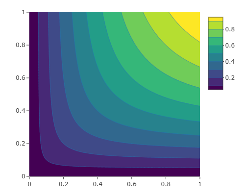
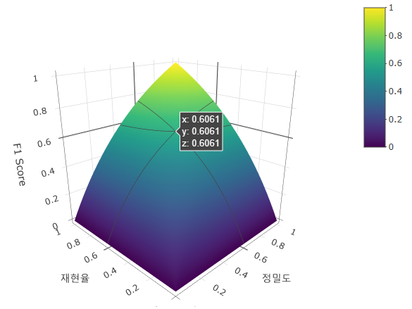

### [Kaggle > Notebook](/README.md#analysis)

# Trends of F1 Score with Changes in Precision and Recall

- 2023.06.25
- [Kaggle Notebook : F1 Score Changes with Precision and Recall](https://www.kaggle.com/code/kangrokkim/f1-score-changes-with-precision-and-recall)
- Almost written by *ChatGPT*

  <details open="">
  <summary>Codes and Outputs</summary>

  ```r
  # 필요한 라이브러리를 로드합니다
  library(plotly)
  library(ggplot2)
  ```

  ```r
  # 데이터를 생성합니다
  precision <- seq(0, 1, length.out = 100)
  recall <- seq(0, 1, length.out = 100)
  f1_score <- outer(precision, recall, FUN = function(p, r) { 2 * (p * r) / (p + r + 1e-10) })

  str(f1_score)
  head(f1_score)
  ```
  ```txt
  num [1:100, 1:100] 0 0 0 0 0 0 0 0 0 0 ...
  ```
  ```txt
  A matrix: 6 × 100 of type dbl
  0	0.00000000	0.00000000	0.00000000	0.00000000	0.00000000	0.00000000	0.00000000	0.00000000	0.00000000	⋯	0.00000000	0.00000000	0.00000000	0.00000000	0.00000000	0.00000000	0.00000000	0.00000000	0.00000000	0.00000000
  0	0.01010101	0.01346801	0.01515152	0.01616162	0.01683502	0.01731602	0.01767677	0.01795735	0.01818182	⋯	0.01998002	0.01998243	0.01998479	0.01998711	0.01998937	0.01999158	0.01999375	0.01999588	0.01999796	0.02000000
  0	0.01346801	0.02020202	0.02424242	0.02693603	0.02886003	0.03030303	0.03142536	0.03232323	0.03305785	⋯	0.03952569	0.03953514	0.03954438	0.03955343	0.03956229	0.03957097	0.03957947	0.03958780	0.03959596	0.03960396
  0	0.01515152	0.02424242	0.03030303	0.03463203	0.03787879	0.04040404	0.04242424	0.04407713	0.04545455	⋯	0.05865103	0.05867182	0.05869219	0.05871212	0.05873165	0.05875077	0.05876951	0.05878788	0.05880588	0.05882353
  0	0.01616162	0.02693603	0.03463203	0.04040404	0.04489338	0.04848485	0.05142332	0.05387205	0.05594406	⋯	0.07736944	0.07740564	0.07744108	0.07747579	0.07750979	0.07754311	0.07757576	0.07760776	0.07763914	0.07766990
  0	0.01683502	0.02886003	0.03787879	0.04489338	0.05050505	0.05509642	0.05892256	0.06216006	0.06493506	⋯	0.09569378	0.09574916	0.09580339	0.09585652	0.09590858	0.09595960	0.09600960	0.09605863	0.09610670	0.09615385
  ```

  ```r
  # 등고선 그래프를 그립니다
  plot_ly(x = precision, y = recall, z = f1_score, type = "contour") %>%
    layout(scene = list(
      xaxis = list(title = "정밀도"),
      yaxis = list(title = "재현율"),
      zaxis = list(title = "F1 Score")
    )) %>%
    layout(width = 500, height = 400, scene = list(aspectmode = "manual"))
  ```
  
  ```r
  # 3차원 등고선 그래프를 그립니다
  fig <- plot_ly(x = precision, y = recall, z = f1_score, type = "surface")
  fig <- fig %>% layout(
    scene = list(
      xaxis = list(title = "정밀도"),
      yaxis = list(title = "재현율"),
      zaxis = list(title = "F1 Score"),
      camera = list(
        eye = list(x = -1.5, y = -1.5, z = 0.8),
        center = list(x = 0, y = 0, z = 0),
        up = list(x = 0, y = 0, z = 1)
      )
    ),
    width = 650,
    height = 500
  )
  fig
  ```
  
  ```r
  # F1 Score 값을 벡터로 변환하고 오름차순으로 정렬합니다
  f1_vector <- sort(as.vector(f1_score))

  # F1 Score의 누적분포 함수 (CDF)를 계산합니다
  cdf <- ecdf(f1_vector)

  # CDF 그래프를 그립니다
  x_values <- seq(0, 1, length.out = 500)
  y_values <- cdf(x_values)
  data <- data.frame(x = x_values, y = y_values)
  plot <- ggplot(data, aes(x, y)) +
    geom_step() +
    labs(x = "F1 Score", y = "CDF") +
    ggtitle("F1 Score의 누적분포 함수 (CDF)")

  # 보조선을 추가합니다
  plot <- plot +
    scale_x_continuous(breaks = seq(0, 1, by = 0.1)) +
    scale_y_continuous(breaks = seq(0, 1, by = 0.1))

  plot
  ```
  
</details>