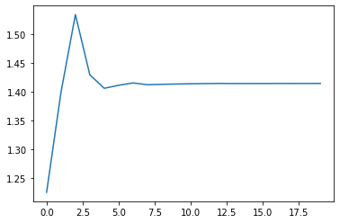
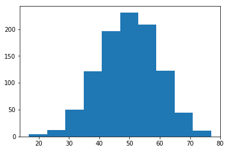
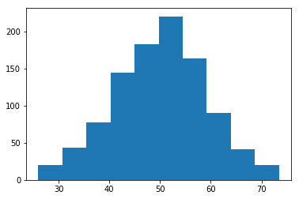
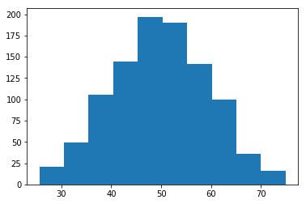

# [My Python Practice](/README.md#python)

I'm sorry R …… I betrayed you.


### \<List>

- [Shuffle List (2020.03.30)](#shuffle-list-20200330)
- [Random Seed Influence (2020.01.05)](#random-seed-influence-20200105)
- [Square Root (2020.01.01) (adjusted 2020.01.04)](#square-root-20200101)
- [Limited Range Sampling (2019.09.22)](#limited-range-sampling-20190922)


## [Shuffle List (2020.03.30)](#list)

- find how to get random lists without overlapping values
- use `random` `random.randint` `random.sample`

  #### `SuffleList.py`

  ```python
  import random
  ```

  <details>
    <summary>Trial 1 : Use random.randint()</summary>

  ```python
  shufflelist1 = []

  for i in range(0,20) :
      random.seed(330 + i)
      shufflelist1.append(random.randint(1, 20))

  print(shufflelist1) # There are overlapping values.
  ```
  </details>

  > [20, 11, 8, 18, 8, 5, 1, 7, 4, 5, 13, 19, 4, 7, 13, 10, 18, 12, 11, 14]

  <details>
    <summary>Trial 2 : Use random.sample()</summary>

  ```python
  random.seed(330)
  shufflelist2 = random.sample(range(1, 21), 20)

  print(shufflelist2) # random.sample() offers values without overlapping.
  ```
  </details>

  > [20, 3, 2, 13, 1, 6, 10, 9, 15, 11, 14, 4, 18, 8, 16, 17, 7, 19, 12, 5]

  <details>
    <summary>Trial 3 : Use while Statement</summary>

  ```python
  shufflelist3 = []
  loopnum = 0

  while len(shufflelist3) < 20 :
      random.seed(330 + loopnum)
      r = random.randint(1,20)
      if r not in shufflelist3 : shufflelist3.append(r)
      loopnum += 1

  print(shufflelist3)
  # It seems similar with Trial 1's sequence but there's no overlapping values.
  ```
  </details>

  > [20, 11, 8, 18, 5, 1, 7, 4, 13, 19, 10, 12, 14, 6, 2, 3, 17, 16, 15, 9]  
  ```python
  print(loopnum) # It shows how many times overlapping numbers are rejected.
  ```
  > 87


## [Random Seed Influence (2020.01.05)](#list)

- Make sure the range of `random.seed()`'s influence  
  ☞ `random.seed()` affects just one time!

  <details>
    <summary>Code : RandomSeedInfluence.py</summary>

  ```python
  import random
  ```

  ```python
  # case 1
  print(random.random())
  print(random.random())
  print(random.random())
  ```
  > 0.48515227527760874  
  > 0.48808537244754757  
  > 0.9509662749522355

  ```python
  # case 2
  random.seed(105)
  print(random.random())
  print(random.random())
  print(random.random())
  ```
  > **0.8780993490764925**  
  > 0.3491186468357038  
  > 0.7907236599059974

  ```python
  # case 2-1
  random.seed(105); print(random.random())
  random.seed(105); print(random.random())
  random.seed(105); print(random.random())
  ```
  > **0.8780993490764925**  
  > **0.8780993490764925**  
  > **0.8780993490764925**

  ```python
  # case 3
  random.seed(105)
  for i in range(0,3) :
      print(random.random())
  ```
  > **0.8780993490764925**  
  > 0.3491186468357038  
  > 0.7907236599059974

  ```python
  # case 3-1
  for i in range(0,3) :
      random.seed(105); print(random.random())
  ```
  > **0.8780993490764925**  
  > **0.8780993490764925**  
  > **0.8780993490764925**
  </details>


## [Square Root (2020.01.01)](#list)

- An algorithm to find n's square root without `math.sqrt()`
- Adjusted 2020.01.04 : rearrange methods' order in `for` Loop for improving intuitive understanding

  <details>
    <summary>Code : SquareRoot.py</summary>

  ```python
  import random
  import math
  import matplotlib.pyplot as plt

  n = 2 # should be larger than 1
  k = 20 # run loop k times

  squareroot = []
  lowerlimit, upperlimit = 1, n

  for i in range(k) :

      random.seed(20200104) # can be removed
      squareroot.append(random.uniform(lowerlimit, upperlimit))
      square = squareroot[i] ** 2
      print(i+1, squareroot[i], square, square-n)

      if square == n :
          break;
      elif square < n :
          # print("smaller")
          lowerlimit = max(squareroot[i], lowerlimit)
      else :
          # print("larger")
          upperlimit = min(squareroot[i], upperlimit)

  myplot = plt.plot(range(k), squareroot)
  # myplot.hlines(math.sqrt(n), color="red", linestyle="--") # doesn't work
  ```
  </details>

  > 1 1.224709461308563 1.4999132646187106 -0.5000867353812894  
  > 2 1.3989245806155413 1.956989982250368 -0.04301001774963198  
  > 3 1.5339919143112415 2.3531311931722674 0.3531311931722674  
  > (중략)  
  > 19 1.4141854421168503 1.9999204646952313 -7.953530476867421e-05  
  > 20 1.4141980335178153 1.9999560780056558 -4.3921994344220394e-05 

  

  <details>
    <summary>Practice</summary>

  ```python
  # practice
  random.random()
  random.randrange(1,n) # output only integer
  random.uniform(1,n) # output float
  list(range(10))
  ```
  > 0.2508550895840985  
  > 1  
  > 1.2710268293926659  
  > [0, 1, 2, 3, 4, 5, 6, 7, 8, 9]  
  </details>


## [Limited Range Sampling (2019.09.22)](#list)

- Generate normal distributed sample with limited range
- Use `numpy` `matplotlib.pyplot` `scipy`

  #### `LimitedRangeSampling.py`

  <details>
    <summary>Generate a normal distribution with limited range [25, 75]</summary>

  ```python
  import numpy as np
  import matplotlib.pyplot as plt
  from scipy import stats

  mu, sigma, n = 50, 10, 1000
  llimit, rlimit = 25, 75

  data = np.random.normal(mu, sigma, n)
  ```
  </details>

  <details>
    <summary>Method 0. Generating initial data (not trimmed yet)</summary>

  ```python
  plt.hist(data)
  stats.describe(data)[0:2] # [0] : nobs, [1] : minmax
  ```
  
  > (1000, (16.763171096395133, 76.969552776105601))
  </details>

  <details>
    <summary>Method 1. Trim with rack of amount</summary>

  ```python
  data1 = data[(data >= llimit) & (data <= rlimit)]
  ```
  ```python
  plt.hist(data1)
  stats.describe(data1)[0:2]
  ```
  
  > (991, (25.600374595125377, 74.942171158969671))
  </details>

  <details>
    <summary>Method 2. Check each one trial</summary>

  ```python
  data2, amount = [], 0

  while amount < n :
      data_temp = np.random.normal(mu, sigma, 1)
      if (data_temp >= llimit) & (data_temp <= rlimit) :
          data2 = np.append(data2, data_temp)
          amount += 1
  ```
  ```python
  plt.hist(data2)
  stats.describe(data2)[0:2]
  ```
  
  > (1000, (25.987274047611137, 73.473315070409228))
  </details>

  <details open="">
    <summary>Method 3. Generate one round and fill the lack</summary>

  ```python
  data3 = data[(data >= llimit) & (data <= rlimit)]
  amount = len(data3)

  while amount < n :
      data_temp = np.random.normal(mu, sigma, 1)
      if (data_temp >= llimit) & (data_temp <= rlimit) :
          data3 = np.append(data3, data_temp)
          amount += 1
  ```
  ```python
  plt.hist(data3)
  stats.describe(data3)[0:2]
  ```
  
  > (1000, (25.600374595125377, 74.942171158969671))
  </details>
